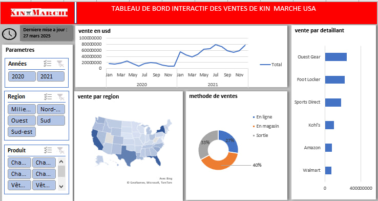

# 📈 Tableau de bord interactif – Ventes de Kin Marché USA

Bienvenue dans ce dépôt GitHub dédié à la **visualisation des ventes** de l’entreprise **Kin Marché** sur le marché des États-Unis.  
Ce tableau de bord interactif, mis à jour en mars 2025, regroupe des données de ventes sur deux années (2020-2021) avec plusieurs dimensions d'analyse.

---

## 🖼️ Aperçu visuel

---

## 🔍 Contenu du tableau de bord

### 📅 Période analysée

- **Années** : 2020 et 2021
- **Dernière mise à jour** : 27 mars 2025

---

### 💰 Évolution des ventes

Un graphique en ligne présente l'évolution des ventes totales (en USD) sur deux ans :
- Progression notable à partir de novembre 2020
- Croissance soutenue durant l’année 2021

---

### 🧭 Paramètres d'analyse

Le tableau permet de filtrer les données selon :
- **Années** : 2020 ou 2021
- **Régions** : Nord, Sud, Ouest, Est, Sud-est, etc.
- **Produits** : Chaussures, Vêtements...

---

### 🌎 Répartition par région

Une carte des États-Unis met en évidence les **zones géographiques** ayant généré le plus de ventes.  
Les États du Sud et du Sud-Est semblent être les marchés les plus actifs.

---

### 🛒 Méthode de vente

Un graphique en anneau montre la part des méthodes utilisées :
- **En ligne** : 40%
- **En magasin** : 33%
- **Sortie (évènements, pop-up, etc.)** : 27%

---

### 🏪 Ventes par détaillant

Un graphique barre met en avant les détaillants principaux :
- **Guest Gear** et **Foot Locker** génèrent les ventes les plus importantes
- Autres détaillants : Sports Direct, Kohl’s, Amazon, Walmart...

---

## 🎯 Objectif du tableau de bord

Ce tableau vise à :
- Suivre l’évolution des ventes de Kin Marché aux USA
- Identifier les zones géographiques stratégiques
- Analyser l’impact des canaux de vente
- Suivre les performances des partenaires détaillants

---

## 🛠️ Outils utilisés

- **Excel** pour la création des visualisations
- **GitHub** pour la documentation et l’archivage

---

## 📬 Contact

Pour plus d'informations ou suggestions, n’hésitez pas à me contacter !

